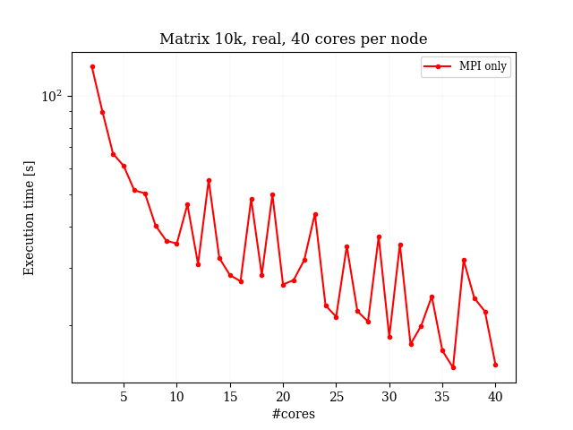
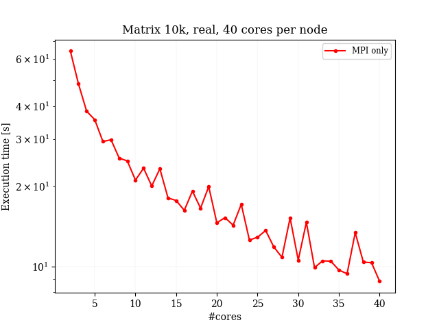

## Maximising the performance for runs with the *ELPA*-library ##

This document should give some hints to the users how to maximize the performance of the *ELPA* solvers. Especially, some typical pitfals are described which can reduce the performance achieved quite dramatically.
For some performance references which have been published in some publications, please have a look at the [*ELPA* performance reference section](https://elpa.mpcdf.mpg.de/performance/index.html) on the [*ELPA* webpage](https://elpa.mpcdf.mpg.de)

### Optimal build of the library ###
Please make sure that *ELPA* is build with compiler optimization flags and that the SIMD vectorization for your hardware is enabled. During the configure step, you should get a warning, if the SIMD vectorization is not set for the CPU you are building *ELPA* on. However, if you want to cross-compile *ELPA* for another platform, you have to take care yourself that SIMD vectorization is enabled for the target system. Please make sure that at the end of the configure output, the appropriate kernels for your hardware are activated. For example, on the latest Intel hardwarev which supports AVX-512 instructions you should see an output like this:

```Fortran
The following ELPA2 kernels will be build:

  real_generic
  real_generic_simple
  real_generic_simple_block4
  real_generic_simple_block6
  real_sse_block2
  real_sse_block4
  real_sse_block6
  real_sse_assembly
  real_avx_block2
  real_avx_block4
  real_avx_block6
  real_avx2_block2
  real_avx2_block4
  real_avx2_block6
  real_avx512_block2 (default)    <-- note than the AVX-512 kernels are listed
  real_avx512_block4
  real_avx512_block6
  complex_generic
  complex_generic_simple
  complex_sse_block1
  complex_sse_block2
  complex_sse_assembly
  complex_avx_block1
  complex_avx_block2
  complex_avx2_block1
  complex_avx2_block2
  complex_avx512_block1 (default) <-- note than the AVX-512 kernels are listed
  complex_avx512_block2
```
#### Builds with OpenMP enabled ####
If you enable OpenMP support in your build of the *ELPA* library -- independent wheter MPI is enabled or disabled -- please ensure that you link against a BLAS and LAPACK library which does offer threading support. If you link with libraries which do not offer support for threading then you will observe a severe performance loss. Please refer to the documentation of your BLAS and LAPACK library, whether threading is supported and how to activate it.


#### Builds for NVIDIA GPU support ####
If you build the NVIDIA GPU version of *ELPA*, please make sure that you set during the configure step the compute capability to the highest level your NVIDIA GPU cards support. Please also ensure that at the end of the configure steps the GPU kernels are listed.

### Runtime pitfalls ###

#### Running with MPI ####
This information holds for all runs of the *ELPA* library if MPI is used, especially for MPI "only" and hybrid MPI-OpenMP runs.

For MPI runs, the *ELPA* library requires that matrices are distributed in a [BLACS block-cyclic distribution](https://www.netlib.org/scalapack/slug/node75.html). During the setup of the BLACS block-cyclic distribution in your application you have to decide on a layout for the matrix representation: you can either choose "row-major" or "column-major". The choice is up to you and migth depend on requirements in your application. The *ELPA* library does work with both choices, but for best performance you should keep your choice in mind and check whether you use within *ELPA* the best process grid for your setting (see below). If it does not matter for you, we recommend to use the setting of "column-major" for the BLACS grid.
Another choice you have to make when using *ELPA* is the distribution of the MPI-tasks into a 2D process grid, which is then used to address the BLACS block-cyclic distributed matrix with "row" and "column" processes. *ELPA* will work correctly with every choice of the 2D process grid, however, for achieving the best performance it is mandatory that the choice of the BLACS layout (column- or row-major) and the 2D MPI process grid (np_rows, np_cols) are consistently set when you call the 

```Fortran
call BLACS_Gridinit(my_blacs_ctxt, layout, np_rows, np_cols) 
```
For example, using 8 MPI processes you could choose a 2D grid with (np_rows=4, np_cols=2), or (np_rows=2,np_cols=4).

You will achieve the best performance, if you set

- np_rows=4, np_cols=2 for layout = "C"
- np_rows=2, np_cols=4 for layout = "R"

The *ELPA* test programs also detail the information about the settings, as is shown in the excerpt below:

```Fortran
Matrix size: 5000
Num eigenvectors: 5000
Blocksize: 16
Num MPI proc: 8
Number of processor rows=4, cols=2, total=8
Process layout: C
```

Note: *ELPA* is also shipped with test programs which show the effect on the performance if the BLACS block-cyclic distribution layout and the 2D process grid are not shown optimal: to observe this you can run, for example:
```Fortran
mpiexec -n 8 ./validate_real_double_eigenvectors_1stage_random_all_layouts 1000 1000 16
```
where the values "1000 1000 16" coresponds to the matrix-size, the number of eigenvectors sought and the blacs block-cyclic block size. You will get timings for all the solutions of the eigenvalue problem in all the possible combinations of the layout and 2D process grid. **CAREFULL:** do this only on small matrix sizes, and a low number of MPI tasks, since otherwise the total runtime will be very large.


#### More on the 2D process grid: quadratic setups and chosing the number of MPI tasks ####
As said, *ELPA* does work correctly independent of the choice of the BLACS layout and the distribution of the 2D process grid (and even if this is sub-optimal, see above). However, some 2D process grids lead to better performance than others. As a rule of thumb, the *ELPA* solvers work best, if the 2D process grid internal to *ELPA* is quadratic or at least as "quadratic" as possible. For example, using ELPA with 16 MPI tasks the setup (MPI-rows, MPI-columns)

- 4,4

works best, the setups

- 8,2
- 2,8
- 16,1 <-- very bad
- 1,16 <-- very bad

do work, but with less optimal performance. Especially, very elongated setups with only one process row (or process column) should be avoided. This also implies, that the runtime of the solution can be influenced by the number of MPI tasks employed: in some situations it might be beneficial to use less MPI tasks than possible, in order to ensure that a good 2D grid can be chosen. For example, on a hypothetical machine with 13 cores, one should **not** use 13 MPI tasks (the only possible combinations are 1,13 or 13,1) but rather use 12 MPI tasks (and leave one core idle), since the better distributions 4,3 or 3,4 could be choosen.

This is illustrated in the figures below, where we show the run-time for the solution of a real 10k matrix with the number of MPI processes varying from 2 to 40. For prime numbers with only very elongated process grids a dramatic performance drop is shown.Note that the setup in process rows and columns is always chosen as optimal as possible. Please also note, that this setup has been tuned to show best the effect of the process grids, the run-time is not optimal in this setup (no optimizations for this build).


|  |  |
|:----------------------------------------:|:----------------------------------------:|
| ELPA 1stage | ELPA 2stage |

If your calling application does have to run with a process grid which is less optimal for *ELPA*, you might want to test the funcionality to re-distribute the matrix and the process grid **internally** to *ELPA* to more suitable values.

#### Hybrid MPI-OpenMP runs ####
For the optimal performance of hybrid MPI-OpenMP runs with the  *ELPA*-library, it is mandatory that you do not overbook the node with a combination of MPI tasks and OpenMP threads. Also, disable "nested OpenMP" and ensure that your threaded BLAS and LAPACK libraries do use more than one thread. Last but not least, please check that on your system the appropriate pinning of the MPI tasks and the OpenMP threads per tasks is ensured. Thus please, keep an eye on
- the number of MPI tasks * OpenMP threads <= number of cores per node
- set the number of OpenMP threads by setting the OMP_NUM_THREADS variable
- set the number of threads in the BLAS and LAPACK library (for Intel's MKL set MKL_NUM_THREADS to a value larger 1)
- check the pinning of MPI tasks and OpenMP threads, but do not pin to hyperthreads


#### GPU runs ####
If you want to use the GPU version of ELPA, please ensure that the same number of MPI tasks is mapped to each GPU in the node. If this cannot be achieved, then do not fully occupy the node with all MPI tasks. For example on a hypothetical node with 34 cores and 3 GPUs, do use only 33 MPI tasks per node and map always 11 MPI tasks to each GPU. Furthermore, if you have (the very common situation) with more than 1 MPI task per GPU, the performance will be improved quite dramatically if you ensure that the NVIDIA MPS daemon is running on each node. Please make sure that the MPS daemon is only started **once** per node. 
If the batch submission script on your HPC system does not offer this automatically you can achieve this by something like this:


```Fortran
In your submission script (example SLURM):

srun ./my_application.sh
```
and the content of my_application.sh:
```Fortran
#!/bin/bash
if [ $SLURM_LOCALID -eq 0 ]; then
   nvidia-cuda-mps-control -d
fi
./validate_real_double_eigenvectors_1stage_gpu_random 80000 80000 16
```

In the above a test program of *ELPA* is run in a SLURM submission script and the NVIDIA MPS daemon is started once on every note. Please adapt this to the batch system used on your HPC systems and refer to the documentation how to achieve this.

For more details for *ELPA*-GPU and NVIDIA MPS please also have a look at [this](https://www.sciencedirect.com/science/article/abs/pii/S0010465520304021) publication.


